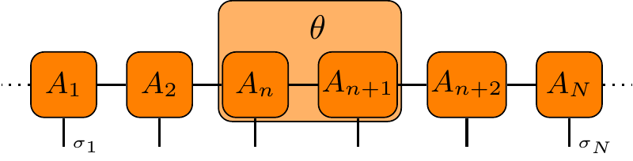

# Collection of tikz figures

This is a collection of [tikz](https://www.ctan.org/pkg/pgf) figures, which I've generated for various papers/seminar talks.

For more examples and details see the great, original [tikz manual](https://tikz.org).


Simply call `make` to generate all the PDFs in subfolders and collect them into the `main_article.pdf`.
Or compile the tex files by hand with `pdflatex -shell-escape file.tex`.

The figures are wrapped with the [standalone](https://www.ctan.org/pkg/standalone) package to produce one PDF per figure.
This means you can directly include the latex file with ``\input{some/figure.tex}``, provided that you include the following preamble:
```latex
\usepackage{standalone}
\usepackage{tikz}
\usepackage{amsmath}
\usepackage{braket}
```
If you have many figures, consider also adding:
```latex
\usetikzlibrary{external}
\tikzexternalize[prefix=cache/]
```
The standalone package has an option `\usepackage[subpreambles,sort]{standalone}` to auto-include packages, but I found this conflicts with the `external` tikz library.

Alternatively, you can directly include the PDFs with `\usepackage{graphicx}` and the usual `\includegraphics(some/figure.pdf}`.


## Tensornetwork tikz library

The `tikzlibrarytensornetwork.code.tex` is a Tikz library with some common definitions for tensor networks.
Simply add it to the folder with the latex main document and `\usetikzlibrary{tensornetwork}` in the preamble.

Then, you can define tensor networks, e.g. like this:

```latex
\begin{tikzpicture}[baseline=(AN.base)]
    \matrix[tmatrix]{
        \node (A1)  [tensor] {$A_1$}; \&
        \node (A2)  [tensor] {$A_2$}; \&
        \node (An)  [tensor] {$A_n$}; \&
        \node (An1) [tensor] {$A_{n+1}$}; \&
        \node (An2) [tensor] {$A_{n+2}$}; \&
        \node (AN)  [tensor] {$A_N$}; \\
    };
    \draw[tedge] 
        (A1) -- (A2) -- (An) -- (An1) -- (An2) -- (AN);
    \draw[tedge,dotted] 
        (A1.west) -- +(-0.3,0.0)
        (AN.east) -- +(+0.3,0.0);
    \foreach \T in {A1,A2,An,An1,An2,AN} 
        \draw[tedge] (\T.south) -- +(0.,-0.3);
    \node at ($ (A1.south) + (0.0,-0.3) $) [tindex,right] {$\sigma_1$};
    \node at ($ (AN.south) + (0.0,-0.3) $) [tindex,right] {$\sigma_N$};
    \node (thl) at (An1.north west) [above] {$\theta$};
    \begin{scope}[on background layer]
        \node (th) [tensor,draw,fit=(An) (An1) (thl)];
    \end{scope}
\end{tikzpicture} 
```
The `tmatrix` allows to adjust the width of the tensors dynamically depending on the content with a default distance of 1cm between tensors;
in other cases it might be more convenient to place the tensors in a fixed coordinate grid with `\node (A1) at (1, 2) [tensor] {$A_1$};`.




